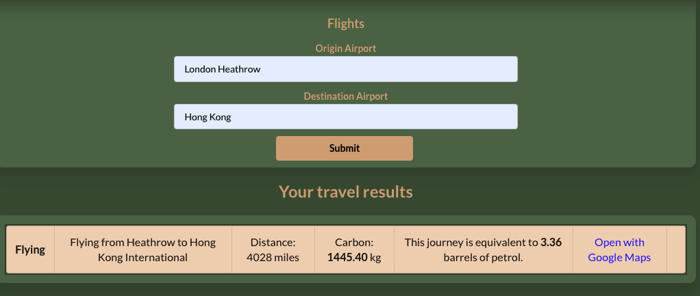

# Project Greenprint frontend API

[](https://travis-ci.org/natyeo/Project_Greenprint_Frontend)


---

# App docs

App is hosted at

```
http://project-greenprint-frontend.herokuapp.com/
```

## Journey

This product is originated from the idea that we want to make a google map alternative with an emphasis on raising awareness of carbon footprint following up to every journey people make.

Aside from that, we also provide a dashboard based on history journey data (available upon signing up) of that specific user, where we display a detailed analysis of:

- carbon(kg) per journey taken by transport mode (rail, car, or plane)
- distance(miles) travelled by transport mode
- total carbon(kg) by mode of transport

Combining these two features together, we are hoping to educate people to make more environment-friendly trips when they plan a journey.

Connect to our app and save the planet now!

## Quickstart

**Installation**
First, clone this repository https://git@github.com:natyeo/Project_Greenprint_Frontend.git. Once inside the root folder run the following command to install dependencies:

```
  bash
  > npm install
  > npm start
```

### Testing

To run tests, navigate to root folder and run command

```bash
npm test
```

## Usages

### Overview of the app


### Plan a ground journey


### Redirect to Google Map


### Plan a flight



### Save journey to dashboard


### Dashboard


## API local usage

API runs with the following technologies:

- [Node JS](https://nodejs.org/en/)
- [Express JS](https://expressjs.com/)

API tested with the following frameworks:

- [Jest](https://jestjs.io/)
- [Supertest](https://github.com/visionmedia/supertest)
